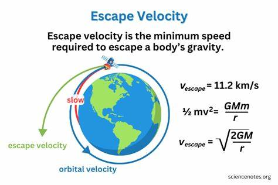

## Problem 2

## **Cosmic Velocities: Definitions, Derivations, and Applications in Space Exploration**

### **1. Definition and Physical Meaning**

In astrodynamics, the **first, second, and third cosmic velocities** represent critical speeds for a body to achieve specific orbital or escape conditions relative to a celestial body.

---

#### **1.1 First Cosmic Velocity (Orbital Velocity)**

* **Definition**: The minimum speed an object must have to maintain a **stable circular orbit** just above the surface of a planet or celestial body.
* **Physical Meaning**: The object is in free fall but constantly missing the surface due to its horizontal speed.
* **Formula**:

  $$
  v_1 = \sqrt{\frac{GM}{R}}
  $$

---

#### **1.2 Second Cosmic Velocity (Escape Velocity)**

* **Definition**: The minimum speed required to **completely escape the gravitational field** of a celestial body without further propulsion.
* **Physical Meaning**: Object has just enough kinetic energy to reach infinity with zero velocity.
* **Formula**:

  $$
  v_2 = \sqrt{\frac{2GM}{R}} = \sqrt{2} \cdot v_1
  $$

---

#### **1.3 Third Cosmic Velocity (Interplanetary/Interstellar Velocity)**

* **Definition**: The minimum speed needed for a spacecraft to **escape the Sun’s gravity** from Earth orbit (or another planet), enabling **interplanetary or interstellar travel**.
* **Physical Meaning**: Escape from both Earth’s and the Sun’s gravitational pulls.
* **Approximate Value from Earth's surface**: \~**16.7 km/s**

---

### **2. Mathematical Analysis and Influencing Parameters**

Each velocity depends on:

* $G$: Gravitational constant
* $M$: Mass of the celestial body
* $R$: Radius of the celestial body (distance from the center of mass)

$$
v_1 \propto \sqrt{\frac{M}{R}}, \quad v_2 \propto \sqrt{\frac{M}{R}}, \quad v_3 \propto \text{(depends on both Earth and Sun parameters)}
$$

---

### **3. Real-World Calculations for Earth, Mars, and Jupiter**

Let’s calculate $v_1$, $v_2$, and approximate $v_3$ for:

| Planet  | Mass (kg)             | Radius (m)         |
| ------- | --------------------- | ------------------ |
| Earth   | $5.97 \times 10^{24}$ | $6.37 \times 10^6$ |
| Mars    | $6.42 \times 10^{23}$ | $3.39 \times 10^6$ |
| Jupiter | $1.90 \times 10^{27}$ | $6.99 \times 10^7$ |

We use:

$$
v_1 = \sqrt{\frac{GM}{R}}, \quad v_2 = \sqrt{2} \cdot v_1
$$

Approximate $v_3$ for Earth uses Sun’s parameters and Earth’s orbital speed.

---

### **4. Applications in Space Exploration**

#### **First Cosmic Velocity Applications**:

* Launching **artificial satellites**
* Establishing **space stations** in low Earth orbit (LEO)

#### **Second Cosmic Velocity Applications**:

* Missions to the **Moon, Mars, or deep space**
* Any **escape trajectory** from Earth

#### **Third Cosmic Velocity Applications**:

* **Interplanetary missions** (e.g., Voyager, New Horizons)
* **Interstellar probes** aiming to exit the Solar System

Understanding these speeds is critical in:

* Fuel and trajectory planning
* Selecting launch windows
* Ensuring mission success

---

### **5. Implementation**

#### **Python Model Outline**:

1. Define planetary data: $M, R$
2. Calculate $v_1$, $v_2$, and estimate $v_3$
3. Visualize results using bar or line plots

#### **Visualization Ideas**:

* Bar chart comparing $v_1, v_2, v_3$ for each planet
* Overlay orbital/escape trajectories (optional)
* Log scale comparison (for emphasis on large values)

---

### **6. Discussion: Limitations and Advanced Considerations**

#### **Limitations**:

* Assumes spherical, non-rotating planets
* Ignores atmospheric drag
* $v_3$ estimated simplistically, without full orbital mechanics

#### **Possible Extensions**:

* Add **atmospheric effects** for realistic launch speeds
* Incorporate **rocket equation** for fuel analysis
* Use **patched conic approximation** for precise interplanetary trajectories

---
### Simulation of Cosmic Velosities 
*[Simulation](project2.html)*
