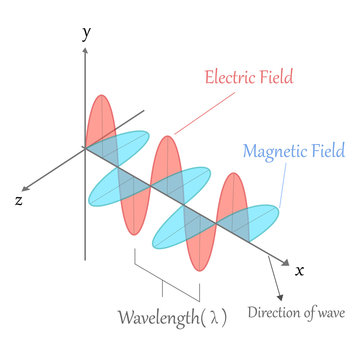

# Problem 1

## **Charged Particle Motion in Electric and Magnetic Fields: Applications and Simulation**

### **1. Applications of the Lorentz Force**

The **Lorentz force** governs the motion of charged particles in electric and magnetic fields:

$$
\vec{F} = q (\vec{E} + \vec{v} \times \vec{B})
$$

Where:

* $\vec{F}$: Force on the particle
* $q$: Charge of the particle
* $\vec{E}$: Electric field
* $\vec{B}$: Magnetic field
* $\vec{v}$: Velocity of the particle

#### **Real-World Applications**

* **Cyclotrons and Synchrotrons:** Use magnetic fields to bend particle paths into circular orbits; electric fields accelerate particles.
* **Mass Spectrometers:** Separate ions based on mass-to-charge ratio via Lorentz deflection.
* **Plasma Confinement (Tokamaks):** Magnetic fields trap and guide high-energy plasma in fusion research.
* **Cathode Ray Tubes:** Use deflection plates and magnetic coils to control electron beams.

---

### **2. Simulating Particle Motion**

The motion is described by Newton’s second law under Lorentz force:

$$
m \frac{d\vec{v}}{dt} = q (\vec{E} + \vec{v} \times \vec{B})
$$

$$
\frac{d\vec{r}}{dt} = \vec{v}
$$

These coupled differential equations can be solved numerically.

---

#### **Case A: Uniform Magnetic Field ($\vec{B} \ne 0, \vec{E} = 0$)**

* Motion is **circular** or **helical**.
* Radius of motion (Larmor radius):

$$
r_L = \frac{mv_\perp}{|qB|}
$$

* Cyclotron frequency:

$$
\omega_c = \frac{|q|B}{m}
$$

#### **Case B: Uniform Electric + Magnetic Fields ($\vec{E} \ne 0, \vec{B} \ne 0$)**

* Results in **helical drift**.
* Drift velocity:

$$
\vec{v}_d = \frac{\vec{E} \times \vec{B}}{B^2}
$$

#### **Case C: Crossed Fields ($\vec{E} \perp \vec{B}$)**

* Uniform drift perpendicular to both fields.
* Can produce **circular, spiral**, or **linear** paths depending on initial velocity and configuration.

---

### **3. Parameter Exploration**

You can analyze how various parameters affect motion:

| Parameter                        | Effect                                      |
| -------------------------------- | ------------------------------------------- |
| **Magnetic field strength** $B$  | Increases curvature of trajectory           |
| **Electric field** $E$           | Adds linear drift or acceleration           |
| **Initial velocity** $\vec{v}_0$ | Affects radius and pitch of helical path    |
| **Charge $q$**                   | Changes direction and magnitude of force    |
| **Mass $m$**                     | Modulates inertia and frequency of gyration |

The simulation allows users to vary:

* $B$, $E$
* $\vec{v}_0$
* $q$, $m$

And observe the resulting 2D and 3D trajectories.

---

### **4. Visualization Techniques**

Visualizations help interpret physical phenomena:

* **2D XY plots**: Show circular motion in a plane perpendicular to $\vec{B}$
* **3D helical paths**: Reveal combined effects of $\vec{v}_\parallel$ and $\vec{v}_\perp$
* **Time-colored plots**: Encode time using color gradients
* **Vector field overlays**: Illustrate direction of $\vec{E}$, $\vec{B}$, and force

### **Highlighting Key Effects**

* **Larmor radius** is visibly smaller with stronger $B$
* **Drift velocity** is observed as net motion in crossed-field simulations

---

### **5. Relevance to Practical Systems**

#### **Cyclotrons**

* Utilize circular motion induced by magnetic fields for particle acceleration.
* Electric fields increase speed at each pass.

#### **Magnetic Traps**

* Confine plasma using spiral motion within magnetic bottles.
* Core to nuclear fusion research.

#### **Electron Beams in CRTs or SEMs**

* Deflected via crossed electric and magnetic fields for imaging and targeting.

---

### **6. Limitations and Extensions**

#### **Limitations**

* Assumes constant fields
* Neglects relativistic effects
* Assumes no collisions or resistance

#### **Potential Extensions**

* Add **non-uniform** or **time-varying** fields
* Incorporate **relativistic mass changes**
* Model **multiple interacting particles**
* Use **adaptive time-stepping** for high-energy paths

---

### Simulating the effects of the Lorentz Force
[Simulation](project1.html)