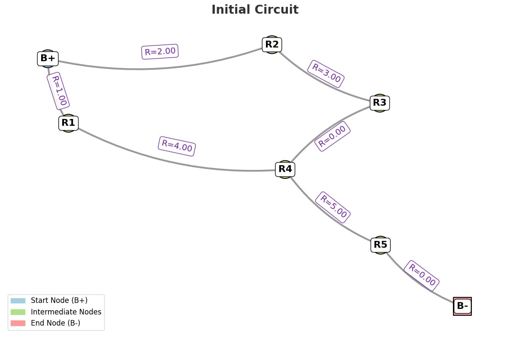
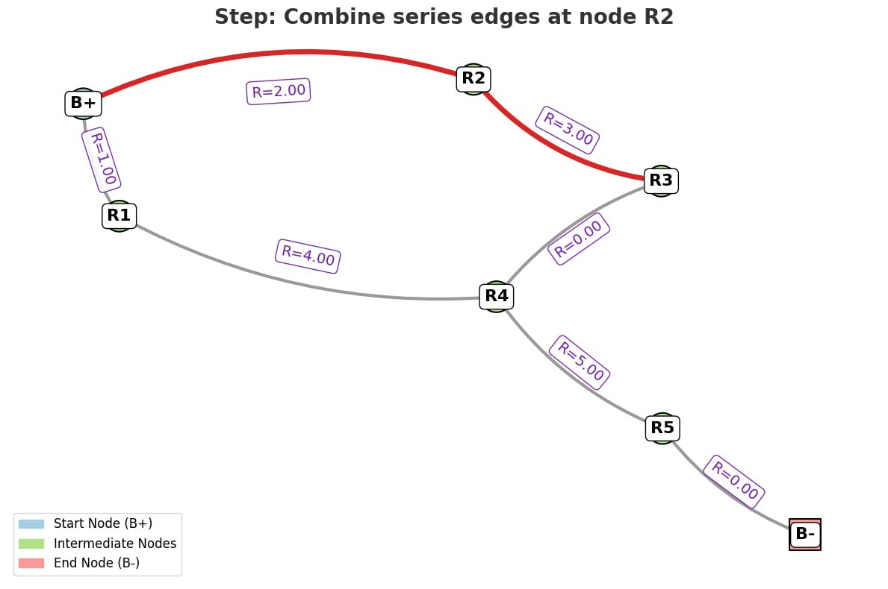
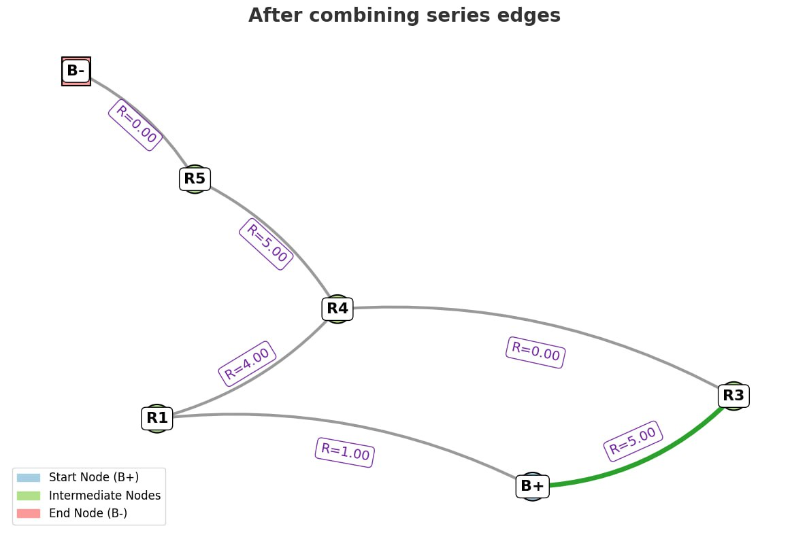
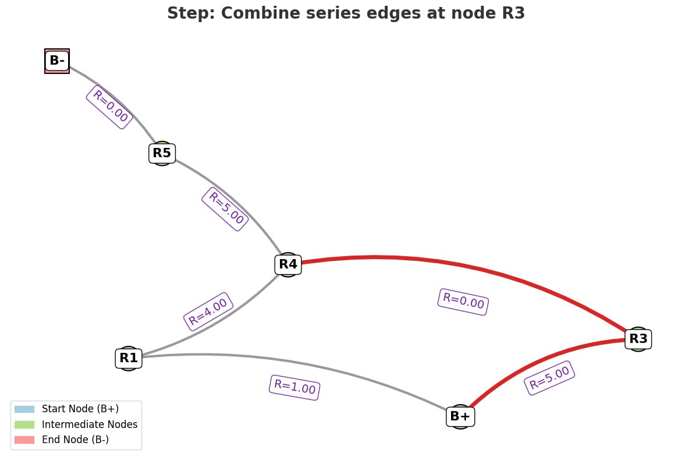
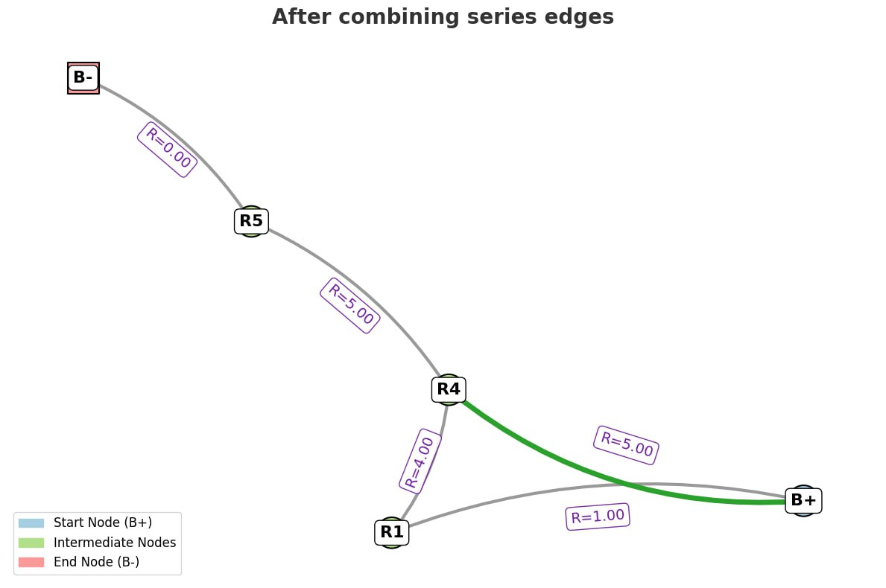
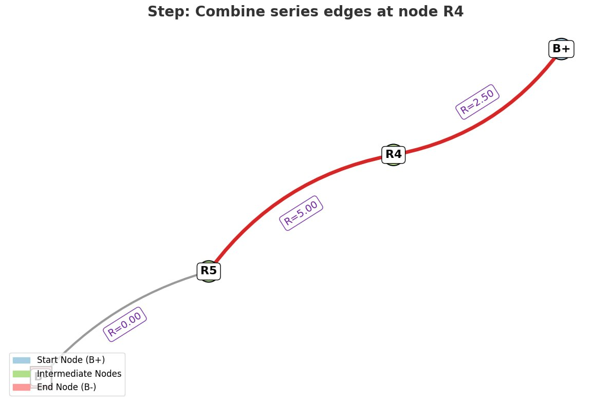
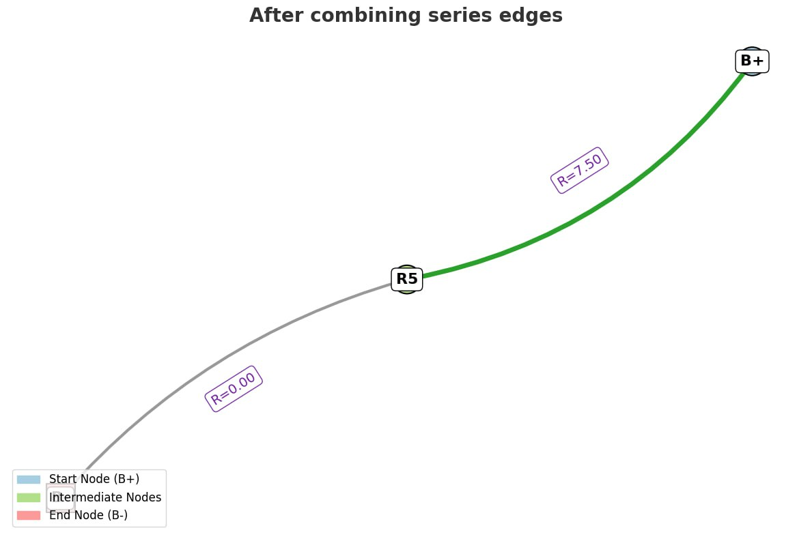
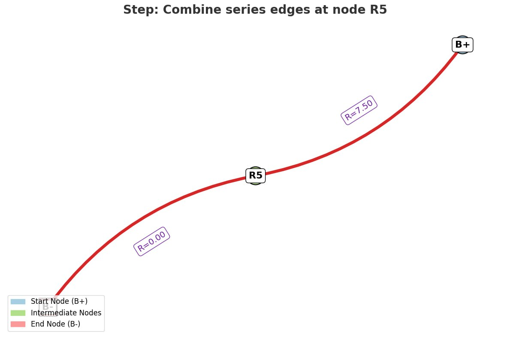
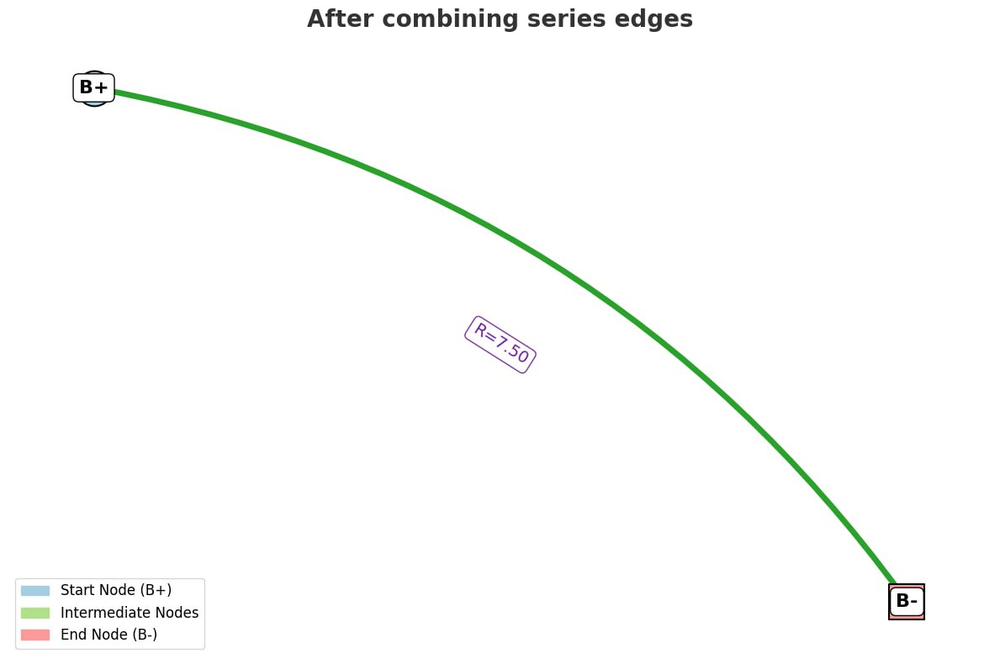
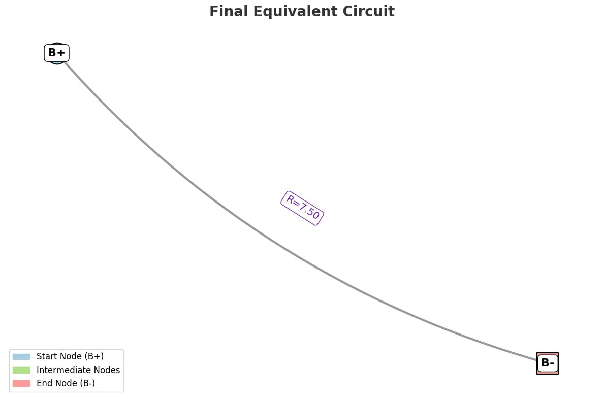

# Problem 1
Certainly! Here's a comprehensive theoretical and algorithmic explanation of how to calculate **equivalent resistance using graph theory**, formatted to suit a Markdown document, with pseudocode and detailed discussion of handling complex circuits.

---

# **Equivalent Resistance Calculation Using Graph Theory**

---

## **1. Introduction**

Calculating equivalent resistance in complex electrical circuits can be automated using graph theory. Each resistor is modeled as an edge with a weight (its resistance), and each junction (node) is a vertex. The goal is to iteratively reduce the graph until only two terminals (start and end) are connected by a single equivalent resistor.

---

## **2. Graph Model of a Circuit**

* **Vertices:** Represent circuit junctions.
* **Edges:** Represent resistors between nodes, weighted by resistance value.
* **Terminals:** Two designated nodes across which equivalent resistance is computed.

---

## **3. Algorithm Overview**

The algorithm uses pattern recognition to reduce:

* **Series combinations**: Identified by nodes of degree 2 not connected to terminals.
* **Parallel combinations**: Identified by multiple edges (or paths) between the same two nodes.

---

## **4. Handling Nested Combinations**

The algorithm handles **nested combinations** by:

* Repeating the simplification steps until no reducible patterns remain.
* Series and parallel structures nested within each other are resolved in a **bottom-up** manner through iteration.
* The approach mimics human reduction: local series/parallel simplifications gradually lead to a fully reduced circuit.

---

## **5. Example Cases**

### **Example 1: Simple Series**

* Nodes: A-B-C
* Edges: A–B (2Ω), B–C (3Ω)
* Equivalent resistance: 5Ω

### **Example 2: Simple Parallel**

* Nodes: A–B
* Edges: A–B (2Ω), A–B (4Ω)
* Equivalent resistance: $1/(1/2 + 1/4) = 1.33Ω$

### **Example 3: Nested Configuration**

* Nodes: A–B–C–D, with:

  * A–B (2Ω), B–C (3Ω), C–D (2Ω)
  * A–C (parallel shortcut, 6Ω)
* The algorithm first reduces B–C and A–B into 5Ω, then handles parallel with A–C.

---

## **6. Algorithm Efficiency**

* Each iteration reduces the number of nodes or edges, ensuring progress.
* Worst-case complexity depends on the number of simplification steps:

  * **Series reduction:** $O(n)$
  * **Parallel detection:** $O(e^2)$ if not optimized
* **Improvements**:

  * Use **union-find** for tracking connected components.
  * Use **networkx** to handle multi-edges and degree tracking efficiently.

---
### Simulation Equivalent Resistance Using Graph Theory
*[Simulation](index.html)*
