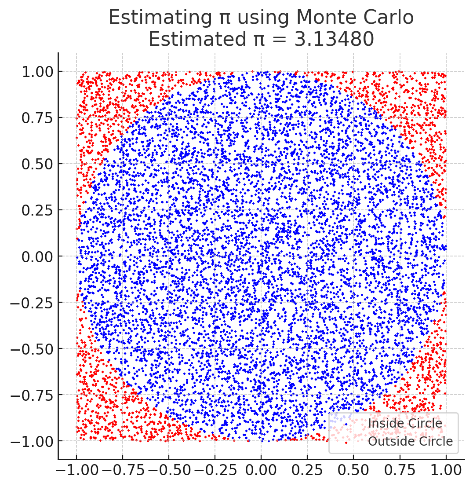
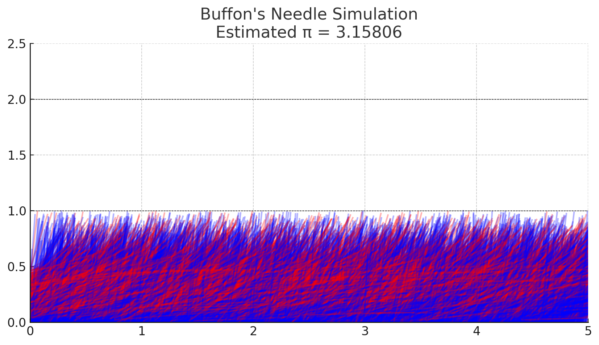

# Problem 2
## **Motivation**

Monte Carlo methods use randomness to solve numerical problems. Estimating π is a classic example where probability and geometry intersect. By simulating random events, we can approximate π in a conceptually simple yet mathematically profound way. Two main methods are commonly used for this purpose: one based on random point generation in a circle, and another based on Buffon’s Needle problem. Both reveal how stochastic processes can yield accurate estimates of fundamental constants.

---

## **Part 1: Estimating π Using a Circle**

### **Theoretical Foundation**

Imagine a unit circle inscribed within a square. The area of the circle is:

$$
A_{\text{circle}} = \pi r^2 = \pi \quad \text{(for } r = 1 \text{)}
$$

The square has side length 2, so its area is:

$$
A_{\text{square}} = 4
$$

If we generate random points uniformly across the square, the proportion that fall inside the circle approximates the ratio of the two areas:

$$
\frac{\text{Points inside circle}}{\text{Total points}} \approx \frac{\pi}{4}
$$

Rearranging gives the formula to estimate π:

$$
\pi \approx 4 \cdot \frac{N_{\text{circle}}}{N_{\text{total}}}
$$

Where:

* $N_{\text{circle}}$ is the number of random points within the circle,
* $N_{\text{total}}$ is the total number of random points.

A point $(x, y)$ lies inside the circle if:

$$
x^2 + y^2 \leq 1
$$

---

### **Analysis**

This method is simple and visually intuitive. However, it converges slowly:

$$
\text{Error} \propto \frac{1}{\sqrt{N}}
$$

This means a very large number of points is needed to achieve high accuracy. Despite that, the method remains a popular teaching tool for illustrating how randomness can yield deterministic results through probability and statistics.

---

## **Part 2: Estimating π Using Buffon’s Needle**

### **Theoretical Foundation**

Buffon’s Needle is a probability problem involving a needle of length $L$ dropped on a floor with parallel lines spaced a distance $D$ apart. If $L \leq D$, the probability $P$ that the needle crosses a line is:

$$
P = \frac{2L}{\pi D}
$$

Solving for π gives:

$$
\pi \approx \frac{2L \cdot N}{D \cdot N_{\text{cross}}}
$$

Where:

* $N$ is the total number of needle drops,
* $N_{\text{cross}}$ is the number of times the needle crosses a line.

To simulate this, a random angle $\theta \in [0, \pi]$ and a random center distance $x \in [0, D/2]$ from the nearest line are used. The needle crosses a line if:

$$
x \leq \frac{L}{2} \sin(\theta)
$$

---

### **Analysis**

Buffon’s Needle connects geometry and probability in a more subtle way than the circle method. It also converges slowly:

$$
\text{Error} \propto \frac{1}{\sqrt{N}}
$$

The method is sensitive to correct angle sampling and needle positioning. While less intuitive than the circle approach, it provides deep insight into probabilistic estimation and was historically one of the first Monte Carlo experiments used to estimate π.

---
## Monte Carlo simulation
*[Simulation](index1.html)*
